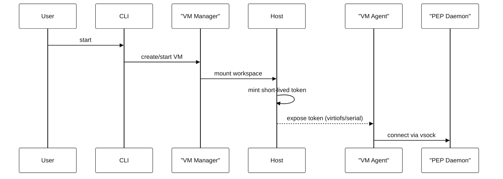
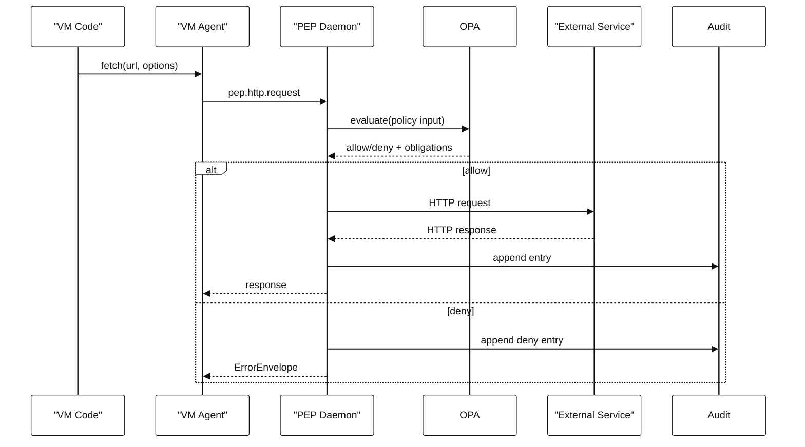
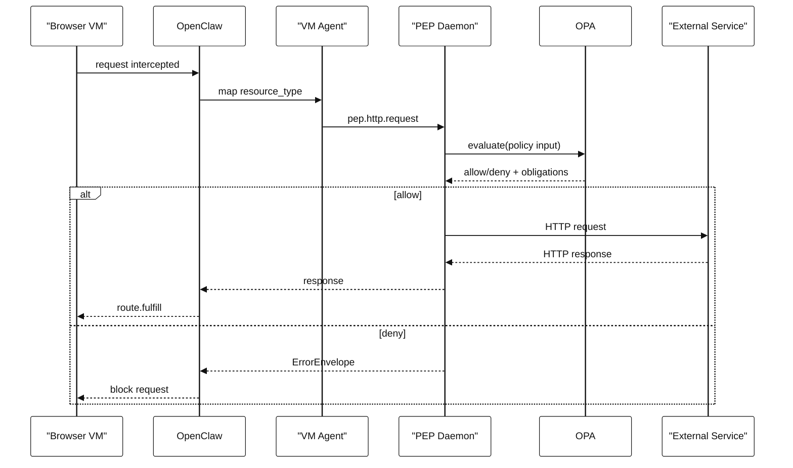
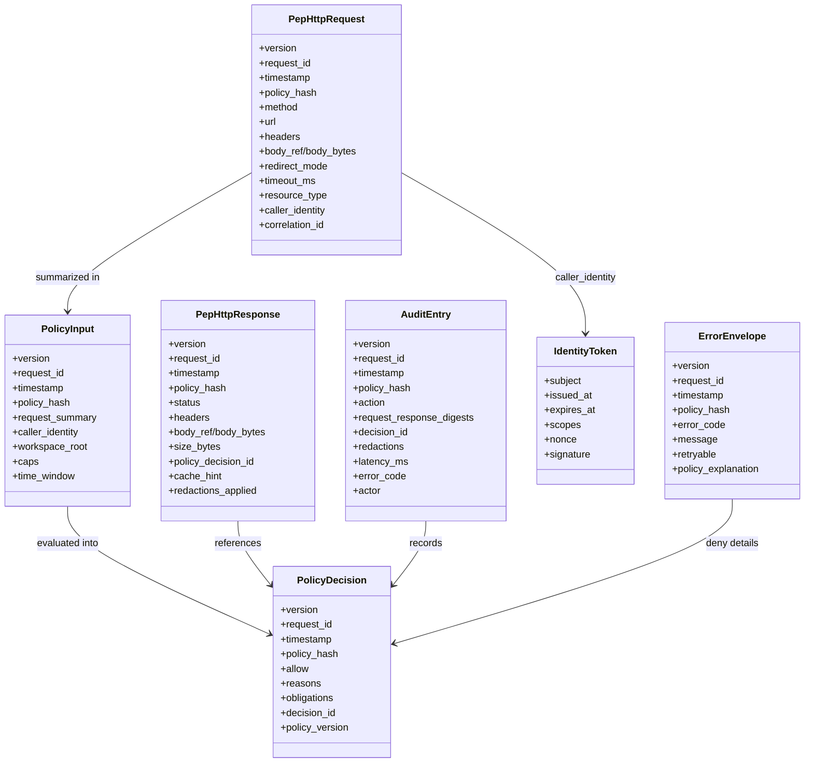

# High-level Architecture (Arc42)

## 1. Introduction and Goals
Build a Mac-first local product that runs Moltbot/OpenClaw inside a Linux VM with no IP networking, and routes all side effects through a trusted host PEP (Rust) enforced by OPA. The system must be safe for untrusted in-process extensions, deny by default, and provide auditable, policy-gated side effects.

Primary goals:
- Full sandboxing with no direct VM egress.
- PEP-mediated side effects with OPA enforcement.
- Local-first UX (CLI for start/stop/status/policy/logs).
- Strong defaults and clear policy explanations.

Out of scope for MVP:
- Enterprise policy hierarchy.
- BYOC/Kubernetes deployment.
- Windows support.
- Full plugin refactor.

## 2. Constraints
- macOS Apple Silicon only (MVP).
- No kernel extensions or reduced security settings.
- VM has no IP networking; only vsock/virtio-serial to host.
- Host PEP runs locally and is the only component with external network access.
- Deny-by-default policies; explicit user allowlists required.
- AVF binaries must be codesigned with `com.apple.security.virtualization`.

## 3. Context and Scope
### 3.1 Business Context
Actors:
- User (developer/operator).
- Untrusted agent (Moltbot/OpenClaw + plugins) inside VM.
- External services (LLM providers, web APIs, messaging).

Interactions:
- VM agent calls PEP for side effects.
- PEP consults OPA and performs side effects if allowed.
- CLI manages VM lifecycle and policies.

### 3.2 Technical Context
External interfaces:
- PEP gRPC over UDS (host-local CLI/UI).
- PEP gRPC over vsock (VM to host).
- Workspace mount via VirtioFS.

## 4. Solution Strategy
- Use Virtualization.framework for VM lifecycle.
- Enforce no-IP networking in VM; only vsock to PEP.
- Route all HTTP via `pep.http.request`.
- Browser automation via CDP interception + PEP fetch + fulfill inside VM.
- Policy-driven constraints (domains, size caps, rate limits, redactions).
- Append-only audit logs with redaction.
- On macOS, bridge vsock to a host-local TCP stub (no direct host vsock bind).

## 5. Building Block View
### 5.1 Whitebox Overview
- Host PEP daemon (Rust) with OPA and audit log.
- VM manager (macOS) for VM lifecycle, mounts, vsock.
- VM agent/shims for fetch override and browser interception.
- Policies and tests (OPA Rego).
- CLI for lifecycle, policy, and logs.

### 5.2 Main Building Blocks
- `pep-daemon`: gRPC APIs, OPA evaluation, SSRF guard, audit.
- `vm-manager`: VM create/start/stop, vsock, mounts.
- `vm-agent`: fetch override + PEP client.
- `openclaw` browser module: CDP interception hook.
- `policies`: deny-by-default and allowlist templates.
- `cli`: user commands.

## 6. Runtime View
### 6.1 Startup
1. User runs CLI `start`.
2. VM manager boots Linux VM and mounts workspace.
3. Host mints short-lived token and exposes via virtiofs or virtio-serial.
4. VM agent reads token and connects to PEP via vsock.

### 6.2 HTTP Side Effect
1. VM code calls fetch (overridden) or browser interception triggers.
2. VM agent sends request to PEP `pep.http.request`.
3. PEP evaluates OPA policy with constraints.
4. If allowed, PEP executes request, enforces caps and redirects.
5. PEP returns response to VM; audit entry recorded.

### 6.3 Browser Request Interception
1. CDP interception installed at context level before navigation.
2. Each request is mapped to `resource_type` and sent to PEP.
3. PEP fetches and returns response for `route.fulfill`.
4. Denied requests return policy error and are blocked.

## 7. Deployment View
- Host: macOS app + Rust daemon + OPA binary.
- VM: minimal Linux image with Node/OpenClaw and vm-agent.
- Data:
  - Workspace mounted to VM.
  - Audit logs and policies on host.
  - VM images stored under app support directory.

## 8. Crosscutting Concepts
- Security: no IP networking in VM; SSRF guard; strict redirect policy.
- Policy: OPA deny-by-default with constraints enforcement.
- Audit: append-only JSONL with redaction and policy hash.
- Error handling: stable error codes and policy explanations.
- Limits: request/response caps, rate limits, concurrency limits.
- Ops: cloud-init seed ISO built via `mkisofs`/`hdiutil` on macOS; bump `instance-id` when updating user-data.

### 8.1 Interaction Data Models
Define schemas up front to keep interfaces stable and reviewable. All models include `version`, `request_id`, `timestamp`, and `policy_hash` where applicable. Use additive changes only; breaking changes require a version bump with a migration note.

- `PepHttpRequest`: method, url, headers, body_ref/body_bytes, redirect_mode, timeout_ms, resource_type, caller_identity, correlation_id.
- `PepHttpResponse`: status, headers, body_ref/body_bytes, size_bytes, policy_decision_id, cache_hint, redactions_applied.
- `PolicyInput`: request summary, caller_identity, workspace_root, caps (bytes, redirects, rate), time window.
- `PolicyDecision`: allow/deny, reasons[], obligations (e.g., redact, cap), decision_id, policy_version.
- `AuditEntry`: action, request/response digests, decision_id, redactions, latency_ms, error_code, actor.
- `IdentityToken`: subject, issued_at, expires_at, scopes, nonce, signature.
- `ErrorEnvelope`: error_code, message, retryable, policy_explanation, request_id.

## 9. Architecture Decisions
- Use Virtualization.framework (Apple Silicon support).
- vsock-only VM to PEP transport.
- CDP interception + PEP fetch for browser requests.
- PEP as sole network egress.
- Downloads restricted to `/workspace/downloads` under policy caps.

## 10. Quality Requirements
- Security: non-bypassable network isolation.
- Reliability: PEP decisions deterministic and auditable.
- Usability: clear policy explanations on deny.
- Performance: reasonable latency for PEP-mediated HTTP.

## 11. Risks and Technical Debt
- Browser interception compatibility on modern sites.
- Buffered `route.fulfill` limits for large assets.
- PEP as concentrated attack surface (SSRF, DoS).
- Dependency on vsock support in Virtualization.framework.
- Console output may be unavailable; rely on shared-workspace markers for boot verification.

## 12. Glossary
- PEP: Policy Enforcement Point.
- OPA: Open Policy Agent.
- CDP: Chrome DevTools Protocol.
- vsock: VM-to-host socket transport.
